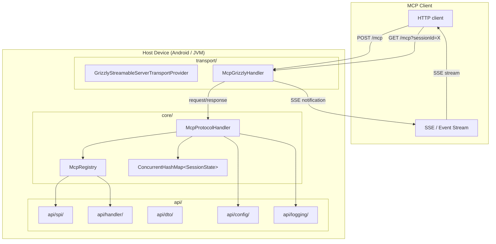
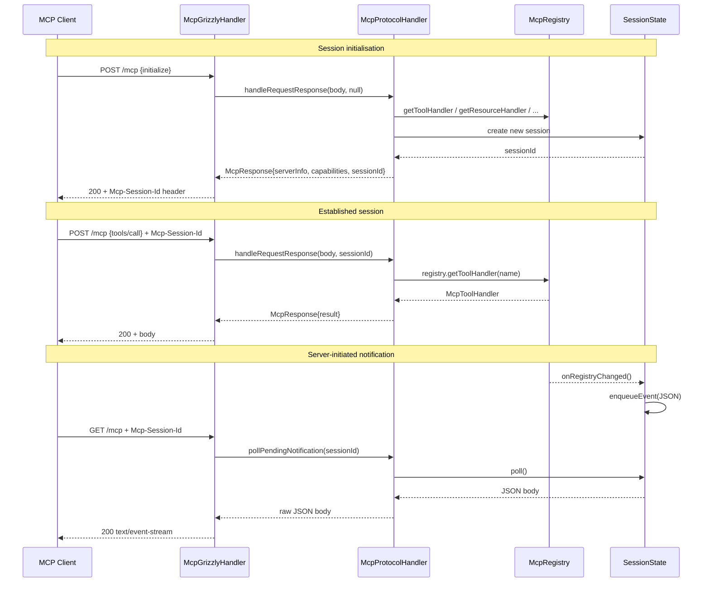
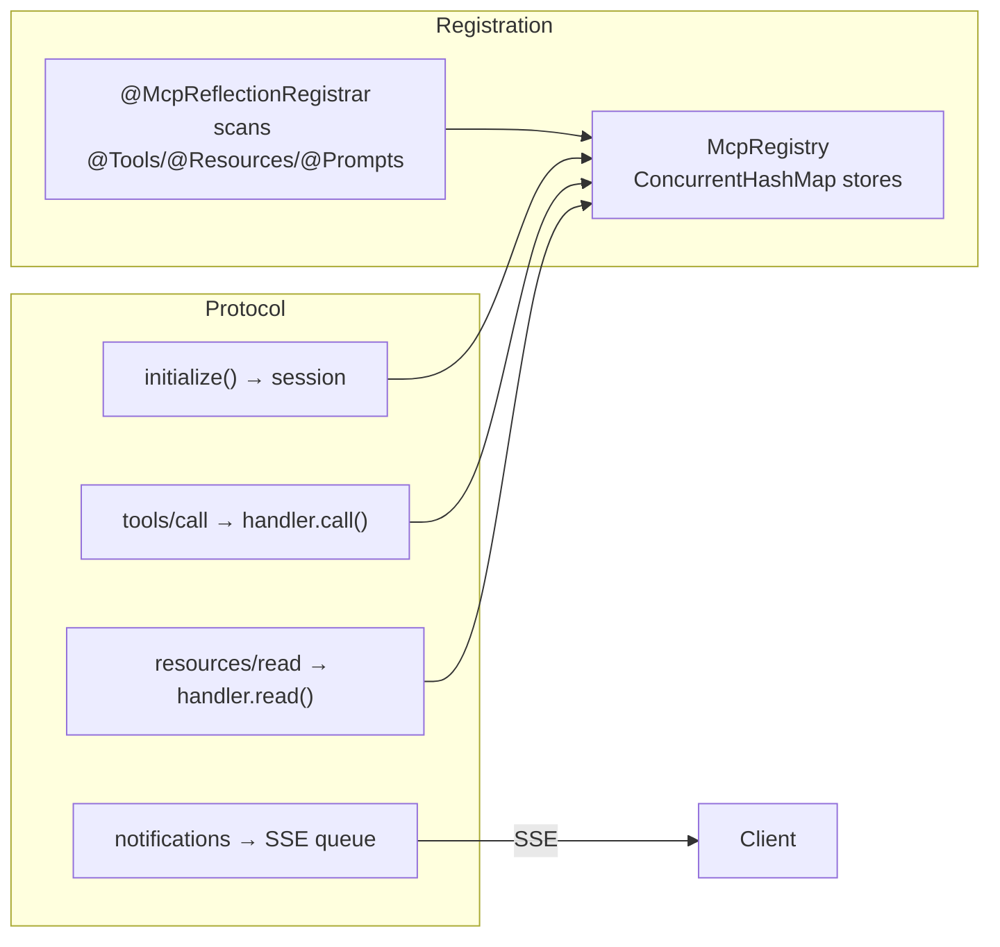
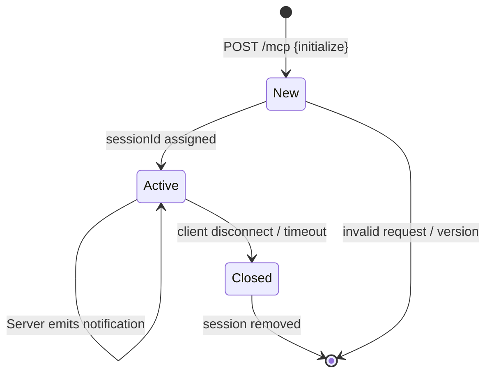
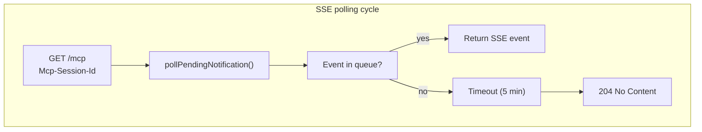

# MCP Java SDK

Single portable Java 8 artifact containing MCP protocol core plus optional Grizzly Streamable HTTP transport and server bootstrap. An Android application can use this SDK to host an MCP server inside the phone app process, provided the selected transport and all runtime dependencies work on the target Android version.

[](https://github.com/vinhphan812/mcp-java-sdk/actions)
[](https://github.com/vinhphan812/mcp-java-sdk/releases/latest)
[](https://adoptium.net/)
[](LICENSE)

---

## Table of contents

- [Quick start](#quick-start)
- [Architecture](#architecture)
- [Package structure](#package-structure)
- [Session lifecycle](#session-lifecycle)
- [Documentation](#documentation)
- [Build](#build)
- [Release](#release)
- [Scope and licensing](#scope-and-licensing)

---

## Quick start

```groovy
// settings.gradle or build.gradle
repositories {
    maven {
        url = uri('https://maven.pkg.github.com/vinhphan812/mcp-java-sdk')
        credentials {
            username = System.getenv('GITHUB_ACTOR')
            password = System.getenv('GITHUB_TOKEN')
        }
    }
}

dependencies {
    implementation 'io.github.vinhphan812.mcp:mcp-java-sdk:1.0.0'
}
```

```java
import io.github.vinhphan812.mcp.api.config.McpServerConfig;
import io.github.vinhphan812.mcp.core.McpServer;
import io.github.vinhphan812.mcp.annotations.*;

public class Main {
    public static void main(String[] args) throws Exception {
        McpServer server = McpServer.builder()
                .config(McpServerConfig.builder()
                        .serverName("my-server")
                        .serverVersion("1.0.0")
                        .protocolVersion("2025-11-25")
                        .tools(true)
                        .resources(true)
                        .prompts(true)
                        .build())
                .host("127.0.0.1")
                .port(3011)
                .endpoint("/mcp")
                .build()
                .register(new MyTools())
                .register(new MyResources());

        server.start();
        System.out.println("MCP server: " + server.getUrl());
        // shutdown: server.close();
    }

    @Tools
    public static class MyTools {
        @McpTool(name = "hello", description = "Says hello")
        public java.util.Map<String, Object> hello(@McpParam(description = "Your name") String name) {
            java.util.Map<String, Object> r = new java.util.LinkedHashMap<>();
            r.put("content", "Hello, " + name + "!");
            return r;
        }
    }

    @Resources
    public static class MyResources {
        @McpResource(uri = "demo://readme")
        public String readme() {
            return "# Hello\n\nThis is a resource.";
        }
    }
}
```

---

## Architecture





---

## Package structure

```mermaid
graph TD
    Root["io.github.vinhphan812.mcp"]

    Root --> Annot["annotations/"]
    Root --> API["api/"]
    Root --> Core["core/"]
    Root --> Trans["transport/"]

    Annot -->|@McpTool| Annot1["@McpParam, @McpResource, @McpPrompt, ..."]
    API --> SPI["api/spi/"]
    API --> H["api/handler/"]
    API --> D["api/dto/"]
    API --> CF["api/config/"]
    API --> L["api/logging/"]
    API --> Reg["McpReflectionRegistrar"]

    SPI -->|McpRegistrar| SPI1["McpResourceUpdateListener, McpRegistryChangeListener"]
    H -->|handler interfaces| H1["McpToolHandler, McpResourceHandler,\nMcpBlobResourceHandler, McpPromptHandler,\nMcpCompletionProvider"]
    D -->|value objects| D1["McpTask, McpBlobContent"]
    CF -->|configuration| CF1["McpServerConfig, McpClientCapabilities"]
    L -->|logging| L1["McpLogger, JulMcpLogger"]
    Core -->|McpServer| Core1["McpProtocolHandler, McpRegistry"]
    Trans -->|Grizzly| Trans1["GrizzlyStreamableServerTransportProvider,\nMcpGrizzlyHandler"]
```



---

## Session lifecycle





---

## Documentation

### Core documentation

| Document | Description |
|---|---|
| [PROJECT-GUIDE.md](docs/PROJECT-GUIDE.md) | Architecture, API surface, protocol reference, transport, and usage guide |
| [API-REFERENCE.md](docs/API-REFERENCE.md) | Complete public API surface: annotations, SPI, handlers, DTO, config, logging |
| [IMPLEMENTATION-STATUS.md](docs/IMPLEMENTATION-STATUS.md) | Completed, incomplete, and unverified areas |
| [GRIZZLY-EXAMPLE.md](docs/GRIZZLY-EXAMPLE.md) | Standalone Grizzly example and HTTP request/response samples |
| [MCP-COMPATIBILITY-2026.md](docs/MCP-COMPATIBILITY-2026.md) | MCP baseline, P0/P1/P2 compatibility status |
| [MCP-PORTING-PLAN.md](docs/MCP-PORTING-PLAN.md) | Package inventory and porting notes |

### Architecture Decision Records

| ADR | Title | Status |
|---|---|---|
| [ADR-0001](docs/adr/ADR-0001-portable-java8-core.md) | Portable Java 8 core without Android SDK | Accepted |
| [ADR-0002](docs/adr/ADR-0002-grizzly-transport-isolation.md) | Grizzly isolated in transport layer | Accepted |
| [ADR-0003](docs/adr/ADR-0003-json-rpc-envelope-protocol-versioning.md) | JSON-RPC 2.0 envelope and versioning strategy | Accepted |
| [ADR-0004](docs/adr/ADR-0004-session-management.md) | Session management with ConcurrentHashMap | Accepted |
| [ADR-0005](docs/adr/ADR-0005-sse-notifications-event-queue.md) | SSE notifications with bounded event queue | Accepted |
| [ADR-0006](docs/adr/ADR-0006-security-model.md) | Origin whitelist, Bearer API key, CRLF sanitisation | Accepted |
| [ADR-0007](docs/adr/ADR-0007-annotation-registration.md) | Annotation-based provider registration | Accepted |
| [ADR-0008](docs/adr/ADR-0008-protocol-baseline-compatibility.md) | Protocol baseline 2025-11-25 compatibility matrix | Accepted |
| [ADR-0009](docs/adr/ADR-0009-code-audit-2026-09-11.md) | Source audit results 2026-09-11 | Accepted |
| [ADR-0010](docs/adr/ADR-0010-api-package-restructure.md) | API package restructure into 5 subpackages | Accepted |

See [docs/adr/README.md](docs/adr/README.md) for the ADR index.

---

## Build

```bash
./gradlew clean test build
```

Outputs:

- `build/libs/mcp-java-sdk-1.0.0.jar` — main artifact
- `build/libs/mcp-java-sdk-1.0.0-sources.jar`
- `build/libs/mcp-java-sdk-1.0.0-javadoc.jar`

Override version for local build:

```bash
./gradlew -PsdkVersion=1.2.3 build
```

Build validation:

- **Tests**: 49 tests pass (`./gradlew test`)
- **Java compatibility**: source/target Java 8
- **Javadoc**: 0 warnings
- **CI**: see [ci.yml](.github/workflows/ci.yml)

---

## Release

Publish a tagged release to create a GitHub Release with JAR artifacts:

```bash
git tag v1.0.0
git push origin v1.0.0
```

This triggers the [Release workflow](.github/workflows/release.yml) which:

1. Runs `./gradlew clean test build`
2. Publishes JAR to GitHub Packages
3. Creates a GitHub Release with main, sources, and javadoc JARs

Releases are available at: https://github.com/vinhphan812/mcp-java-sdk/releases

---

## Scope and licensing

### Included

- Annotations (`@McpTool`, `@McpResource`, `@McpPrompt`, ...)
- Registration SPI and reflection registrar
- Handler interfaces (tool, resource, prompt, completion)
- DTOs (`McpTask`, `McpBlobContent`)
- Configuration (`McpServerConfig`, `McpClientCapabilities`)
- Logging (`McpLogger`, `JulMcpLogger`)
- Protocol core (`McpProtocolHandler`, `McpRegistry`)
- Grizzly Streamable HTTP transport
- SSE notifications, session management, progress/cancellation, `tasks/create`
- JSON-RPC 2.0, protocol versioning, Origin/CORS security

### Excluded

- WebSocket transport
- STDIO transport
- Android application services
- Robot/ROSA domain models
- Authentication backends
- Persistence
- Sampling / elicitation (future protocol versions)

### Dependencies

- [Gson 2.11.0](https://github.com/google/gson) — Apache 2.0
- [Grizzly HTTP Server 4.0.2](https://github.com/eclipse-ee4j/grizzly) — CDDL/GPL dual-license

Review upstream notices before redistribution.

### License

Apache License 2.0 — see [LICENSE](LICENSE).
