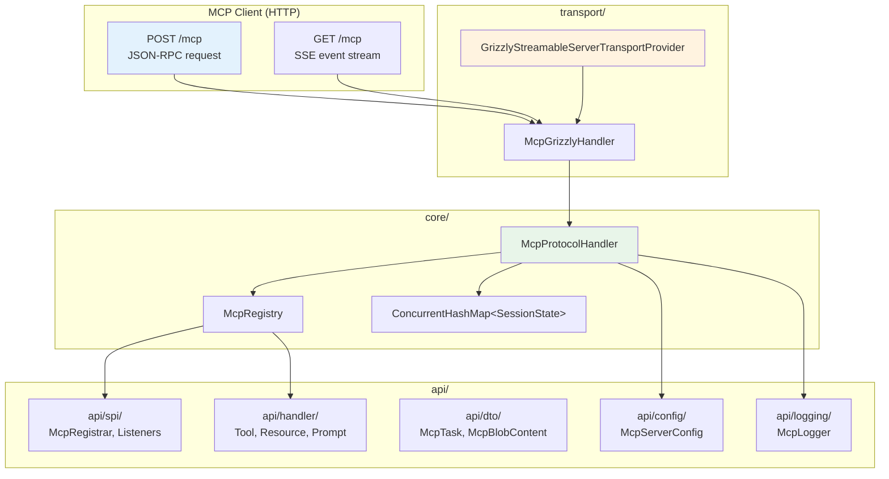
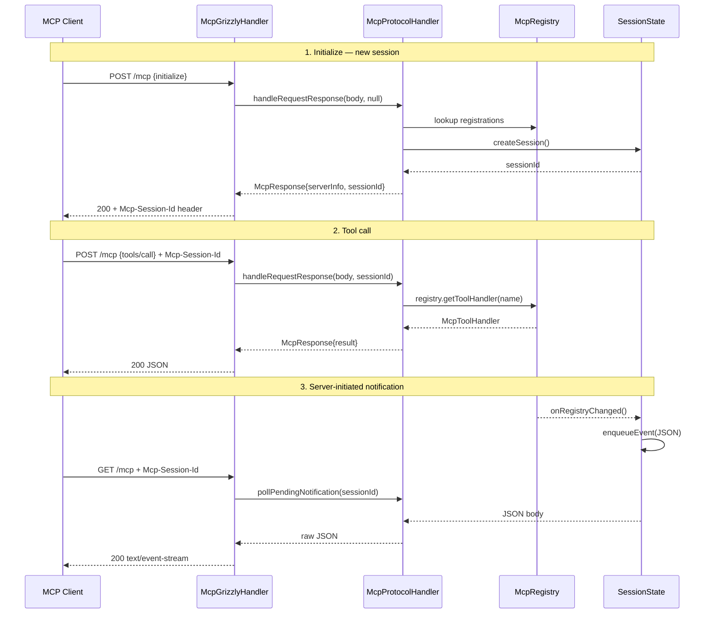
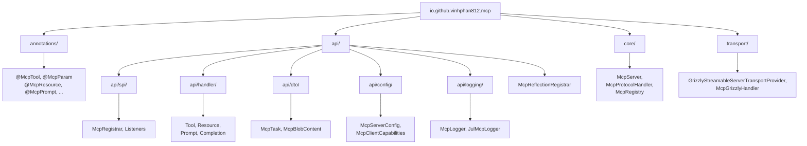
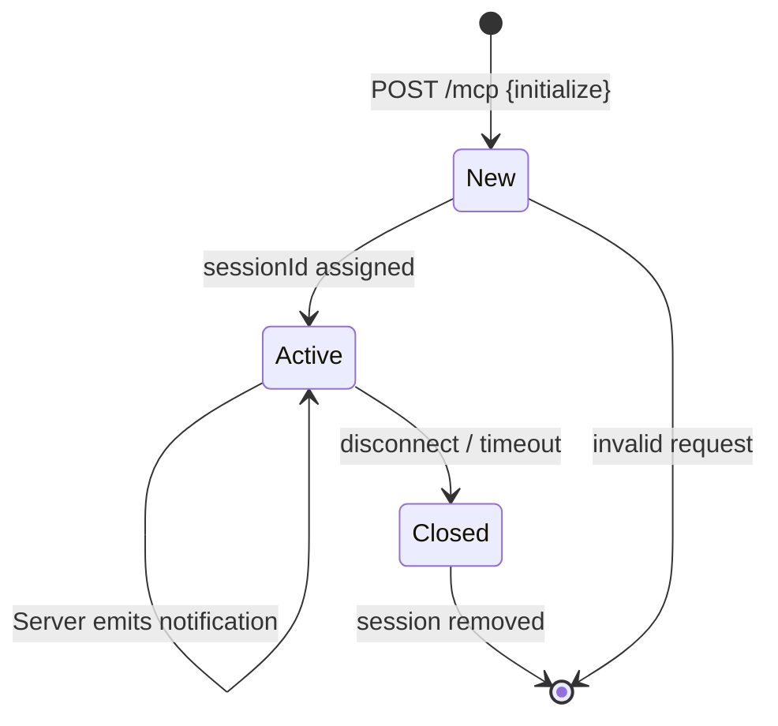

# MCP Java SDK

Portable Java 8 library for hosting an [MCP](https://modelcontextprotocol.io) server inside any Java application — including Android apps, Android/ROSA robots, desktop services, and backend servers. A phone or robot can act as an MCP server, exposing tools, resources, and prompts over HTTP to MCP clients on the same device or network.

[](https://github.com/vinhphan812/mcp-java-sdk/actions)
[](https://github.com/vinhphan812/mcp-java-sdk/releases/latest)
[](https://adoptium.net/)
[](LICENSE)
[](https://github.com/vinhphan812/mcp-java-sdk)

---

## Table of contents

- [Installation](#installation)
- [Quick start](#quick-start)
- [Architecture](#architecture)
- [Package structure](#package-structure)
- [Session lifecycle](#session-lifecycle)
- [Documentation](#documentation)
- [Build](#build)
- [Contributing](#contributing)
- [Release](#release)
- [Scope and licensing](#scope-and-licensing)

---

## Installation

### Gradle (GitHub Packages)

The SDK is published to [GitHub Packages](https://github.com/vinhphan812/mcp-java-sdk/packages). You need a GitHub token with `read:packages` scope.

```groovy
// settings.gradle.kts  (or settings.gradle)
pluginManagement {
    repositories {
        gradlePluginPortal()
        maven {
            url = uri("https://maven.pkg.github.com/vinhphan812/mcp-java-sdk")
            content {
                includeGroup("io.github.vinhphan812.mcp")
            }
        }
    }
}

dependencyResolutionManagement {
    repositories {
        mavenCentral()
        maven {
            url = uri("https://maven.pkg.github.com/vinhphan812/mcp-java-sdk")
            credentials {
                username = System.getenv("GITHUB_ACTOR") ?: project.findProperty("gpr.user")
                password = System.getenv("GITHUB_TOKEN") ?: project.findProperty("gpr.token")
            }
        }
    }
}

dependencies {
    implementation("io.github.vinhphan812.mcp:mcp-java-sdk:1.0.0")
}
```

#### Generate a GitHub token

1. Go to https://github.com/settings/tokens
2. Click **Generate new token (classic)**
3. Select scopes: `read:packages`
4. Copy the token and set it as an environment variable:

```bash
# Linux / macOS
export GITHUB_TOKEN=ghp_your_token_here

# Windows (Git Bash)
export GITHUB_TOKEN=ghp_your_token_here

# Windows (CMD)
set GITHUB_TOKEN=ghp_your_token_here
```

Or add to `~/.gradle/gradle.properties`:

```properties
gpr.user=your-github-username
gpr.token=ghp_your_token_here
```

### Local JAR (no authentication)

If you only need the JAR file without GitHub Packages:

1. Download from the [latest release](https://github.com/vinhphan812/mcp-java-sdk/releases/latest)
2. Or build locally (see [Build](#build)):

```bash
./gradlew clean build
# JARs are in: build/libs/
```

```groovy
dependencies {
    implementation(files("path/to/mcp-java-sdk-1.0.0.jar"))
}
```

### Clone the repository

```bash
git clone https://github.com/vinhphan812/mcp-java-sdk.git
cd mcp-java-sdk
```

---

## Quick start

A minimal example that starts an MCP server on Android or any Java 8+ runtime:

```java
import io.github.vinhphan812.mcp.api.config.McpServerConfig;
import io.github.vinhphan812.mcp.core.McpServer;
import io.github.vinhphan812.mcp.annotations.*;

public class Main {
    public static void main(String[] args) throws Exception {
        // 1. Build server with configuration
        McpServer server = McpServer.builder()
                .config(McpServerConfig.builder()
                        .serverName("my-server")
                        .serverVersion("1.0.0")
                        .protocolVersion("2025-11-25")
                        .tools(true)
                        .resources(true)
                        .prompts(true)
                        .build())
                .host("127.0.0.1")
                .port(3011)
                .endpoint("/mcp")
                // Optional: protect with Bearer token
                // .apiKeySupplier(() -> System.getenv("MCP_API_KEY"))
                .build()

                // 2. Register provider classes
                .register(new MyTools())
                .register(new MyResources())
                .register(new MyPrompts());

        // 3. Start server
        server.start();
        System.out.println("MCP server: " + server.getUrl());

        // 4. Shutdown on exit
        Runtime.getRuntime().addShutdownHook(new Thread(server::close));
    }

    @Tools
    public static class MyTools {
        @McpTool(name = "hello", description = "Says hello to the user")
        public java.util.Map<String, Object> hello(
                @McpParam(description = "Your name") String name) {
            java.util.Map<String, Object> r = new java.util.LinkedHashMap<>();
            r.put("content", "Hello, " + name + "!");
            return r;
        }

        @McpTool(name = "calculate-total", description = "Calculates total price")
        public java.util.Map<String, Object> calculateTotal(
                @McpParam(description = "Item name") String item,
                @McpParam(description = "Quantity", required = true) int quantity,
                @McpParam(description = "Unit price", required = true) double unitPrice) {
            double total = quantity * unitPrice;
            java.util.Map<String, Object> r = new java.util.LinkedHashMap<>();
            r.put("item", item);
            r.put("quantity", quantity);
            r.put("unitPrice", unitPrice);
            r.put("total", total);
            return r;
        }
    }

    @Resources
    public static class MyResources {
        @McpResource(uri = "demo://readme")
        public String readme() {
            return "# Hello\n\nThis is a resource.";
        }

        @McpResourceTemplate(uri = "demo://users/{userId}")
        public String getUser(@McpParam(description = "User ID") String userId) {
            return "{\"userId\":\"" + userId + "\",\"name\":\"User " + userId + "\"}";
        }
    }

    @Prompts
    public static class MyPrompts {
        @McpPrompt(name = "explain-user", description = "Explains a user profile")
        public java.util.Map<String, Object> explainUser(
                @McpParam(description = "User ID", required = true) String userId) {
            java.util.Map<String, Object> r = new java.util.LinkedHashMap<>();
            r.put("role", "user");
            r.put("content",
                "Please provide a detailed summary of the user with ID: " + userId);
            return r;
        }
    }
}
```

### Testing the server

```bash
# Start the server, then in another terminal:

# 1. Initialize session
curl -s -X POST http://127.0.0.1:3011/mcp \
  -H "Content-Type: application/json" \
  -H "Accept: application/json" \
  -d '{"jsonrpc":"2.0","id":1,"method":"initialize","params":{"protocolVersion":"2025-11-25","capabilities":{},"clientInfo":{"name":"test","version":"1"}}}'

# 2. Call a tool
curl -s -X POST http://127.0.0.1:3011/mcp \
  -H "Content-Type: application/json" \
  -H "Mcp-Session-Id: <session-id-from-step-1>" \
  -d '{"jsonrpc":"2.0","id":2,"method":"tools/call","params":{"name":"hello","arguments":{"name":"World"}}}'
```

---

## Architecture





---

## Package structure



---

## Session lifecycle



---

## Documentation

### Core documentation

| Document | Description |
|---|---|
| [PROJECT-GUIDE.md](docs/PROJECT-GUIDE.md) | Architecture, API, protocol, transport, and usage guide |
| [API-REFERENCE.md](docs/API-REFERENCE.md) | Complete public API surface |
| [IMPLEMENTATION-STATUS.md](docs/IMPLEMENTATION-STATUS.md) | Completed, incomplete, and unverified areas |
| [GRIZZLY-EXAMPLE.md](docs/GRIZZLY-EXAMPLE.md) | Standalone example and HTTP request samples |
| [MCP-COMPATIBILITY-2026.md](docs/MCP-COMPATIBILITY-2026.md) | MCP baseline and P0/P1/P2 compatibility |
| [MCP-PORTING-PLAN.md](docs/MCP-PORTING-PLAN.md) | Package inventory and porting notes |

### Architecture Decision Records

| ADR | Title | Status |
|---|---|---|
| [ADR-0001](docs/adr/ADR-0001-portable-java8-core.md) | Portable Java 8 core without Android SDK | Accepted |
| [ADR-0002](docs/adr/ADR-0002-grizzly-transport-isolation.md) | Grizzly isolated in transport layer | Accepted |
| [ADR-0003](docs/adr/ADR-0003-json-rpc-envelope-protocol-versioning.md) | JSON-RPC 2.0 and versioning | Accepted |
| [ADR-0004](docs/adr/ADR-0004-session-management.md) | Session management | Accepted |
| [ADR-0005](docs/adr/ADR-0005-sse-notifications-event-queue.md) | SSE event queue | Accepted |
| [ADR-0006](docs/adr/ADR-0006-security-model.md) | Security: Origin, Bearer, CRLF | Accepted |
| [ADR-0007](docs/adr/ADR-0007-annotation-registration.md) | Annotation-based registration | Accepted |
| [ADR-0008](docs/adr/ADR-0008-protocol-baseline-compatibility.md) | Protocol baseline 2025-11-25 | Accepted |
| [ADR-0009](docs/adr/ADR-0009-code-audit-2026-09-11.md) | Source audit 2026-09-11 | Accepted |
| [ADR-0010](docs/adr/ADR-0010-api-package-restructure.md) | API package restructure | Accepted |

See [docs/adr/README.md](docs/adr/README.md) for the ADR index.

---

## Build

```bash
./gradlew clean test build
```

Outputs:

| File | Description |
|---|---|
| `build/libs/mcp-java-sdk-1.0.0.jar` | Main artifact |
| `build/libs/mcp-java-sdk-1.0.0-sources.jar` | Source code |
| `build/libs/mcp-java-sdk-1.0.0-javadoc.jar` | API documentation |

Override version for local build:

```bash
./gradlew -PsdkVersion=1.2.3 build
```

Build validation:

- **Tests**: 49 tests pass
- **Java compatibility**: source/target Java 8 (bytecode 52)
- **Javadoc**: 0 warnings
- **CI**: [.github/workflows/ci.yml](.github/workflows/ci.yml)

---

## Contributing

1. Fork the repository
2. Create a feature branch: `git checkout -b feat/my-feature`
3. Make changes and add tests
4. Run the test suite: `./gradlew test`
5. Commit with a clear message: `git commit -m "feat: add my feature"`
6. Push: `git push origin feat/my-feature`
7. Open a Pull Request against `master`

---

## Release

Tag a version to trigger the release workflow:

```bash
git tag v1.0.1
git push origin v1.0.1
```

The [Release workflow](.github/workflows/release.yml) automatically:

1. Runs `./gradlew clean test build`
2. Publishes JAR to GitHub Packages
3. Creates a GitHub Release with all artifacts

Releases: https://github.com/vinhphan812/mcp-java-sdk/releases

---

## Scope and licensing

### Included

- Annotations (`@McpTool`, `@McpResource`, `@McpPrompt`, ...)
- Reflection registrar (`McpReflectionRegistrar`)
- Handler interfaces (tool, resource, prompt, completion)
- DTOs (`McpTask`, `McpBlobContent`)
- Configuration (`McpServerConfig`, `McpClientCapabilities`)
- Logging (`McpLogger`, `JulMcpLogger`)
- Protocol core (`McpProtocolHandler`, `McpRegistry`)
- Grizzly Streamable HTTP transport
- SSE notifications, progress/cancellation, `tasks/create`
- JSON-RPC 2.0, protocol versioning, Origin/CORS security

### Android and robot hosting

The library runs inside an Android app or robot service process. A phone or robot can act as an MCP server — no separate backend needed. Android API 21+ is the typical target; verify Grizzly compatibility on the target runtime.

See [docs/PROJECT-GUIDE.md](docs/PROJECT-GUIDE.md) for Android hosting guidance and runtime verification checklist.

### Excluded

- WebSocket transport (use external bridge if needed)
- STDIO transport
- Robot/ROSA domain models (belong in the consuming application)
- Authentication backends (supply through the public API)
- Persistence (supply through resources or application code)
- Sampling / elicitation (protocol extension, not yet implemented)

### Dependencies

| Library | Version | License |
|---|---|---|
| [Gson](https://github.com/google/gson) | 2.11.0 | Apache 2.0 |
| [Grizzly HTTP Server](https://github.com/eclipse-ee4j/grizzly) | 4.0.2 | CDDL/GPL |

Review upstream notices before redistribution.

### License

Apache License 2.0 — see [LICENSE](LICENSE).
