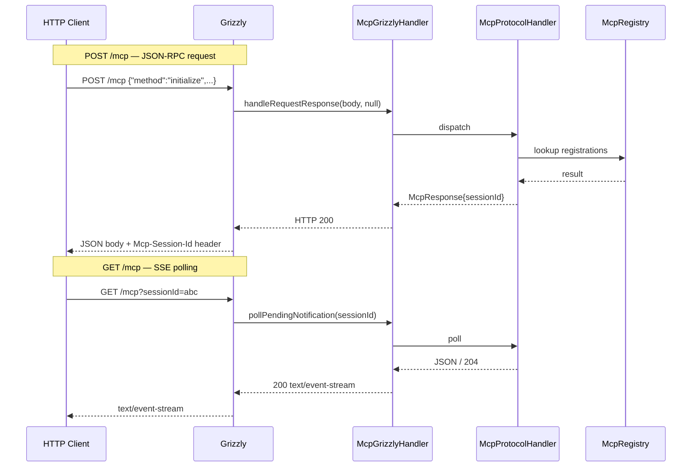
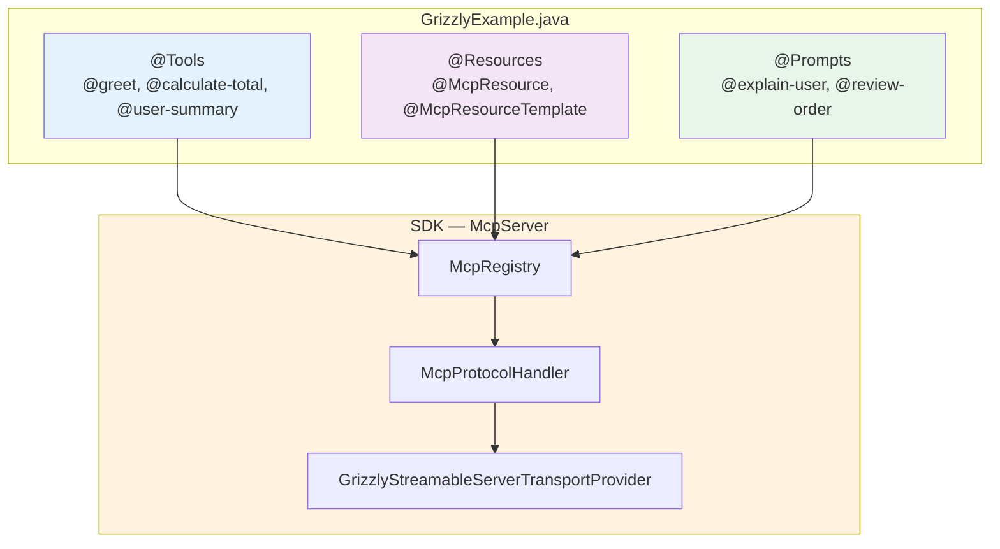

# Grizzly MCP Example

`examples/src/main/java/io/github/vinhphan812/mcp/examples/GrizzlyExample.java` is a standalone Java 8 server using the SDK's Grizzly Streamable HTTP transport. It binds to `http://127.0.0.1:3011/mcp` and demonstrates a coherent small catalogue domain.

See also: [PROJECT-GUIDE.md](PROJECT-GUIDE.md) | [API-REFERENCE.md](API-REFERENCE.md) | [MCP-COMPATIBILITY-2026.md](MCP-COMPATIBILITY-2026.md)





## Registered items

| Kind              | Name or URI               | Behaviour                                                                                                             |
|-------------------|---------------------------|-----------------------------------------------------------------------------------------------------------------------|
| Tool              | `greet`                   | Directly binds required `String name`; returns text content.                                                          |
| Tool              | `calculate-total`         | Directly binds `String item`, required `int quantity`, and required `double unitPrice`; returns the calculated total. |
| Tool              | `user-summary`            | Directly binds `String userId`; returns a profile URI and summary.                                                    |
| Exact resource    | `demo://readme`           | Static plain-text SDK overview.                                                                                       |
| Exact resource    | `demo://catalog`          | Static JSON catalogue.                                                                                                |
| Resource template | `demo://users/{userId}`   | `resources/read` resolves a user URI and returns JSON.                                                                |
| Resource template | `demo://orders/{orderId}` | `resources/read` resolves an order URI and returns JSON.                                                              |
| Prompt            | `explain-user`            | Required `userId`; creates a user-profile explanation message.                                                        |
| Prompt            | `review-order`            | Required `orderId` and optional `focus`; creates an order-review message.                                             |

The provider classes are marked `@Tools`, `@Resources`, and `@Prompts`. Every annotated method uses the corresponding
`@McpTool`, `@McpResource`, `@McpResourceTemplate`, or `@McpPrompt` annotation.

## Direct parameter binding

The example intentionally uses direct `@McpParam` binding instead of passing one argument map to every method:

```java

@McpTool(name = "calculate-total")
public Map<String, Object> calculateTotal(
        @McpParam(name = "item", required = true) String item,
        @McpParam(name = "quantity", type = "integer", required = true) int quantity,
        @McpParam(name = "unitPrice", type = "number", required = true) double unitPrice) {
    // ...
}
```

The reflection registrar builds the advertised input schema and maps JSON values by annotation name. Missing required
values and incompatible JSON types produce an argument error. A method with one `Map<String,Object>` parameter remains
supported for compatibility. Resource handlers still receive the resolved URI `String`; resource methods return`String`,
while tools and prompts return `Map<String,Object>` MCP result shapes.

## Capabilities and bootstrap

The example advertises tools, resources, and prompts. It also enables the SDK's configured logging, completions, tasks,
resource subscriptions, and an experimental `grizzly-example` capability. The completion provider is registered for the
`demo` reference type. These registrations demonstrate configuration surfaces; they do not imply complete protocol
support (see limitations below).

The server is built with `McpServer.builder()`, registers all three providers before startup, and prints the URL and
registered item names. `Ctrl+C` invokes the shutdown hook.

## Request examples

First initialise and retain the returned `Mcp-Session-Id` header. Send `notifications/initialized` next. Include
`Content-Type: application/json` and an `Accept` value allowing `application/json` (and, when needed,
`text/event-stream`). Replace `<SESSION_ID>` below.

```json
{
  "jsonrpc": "2.0",
  "id": 1,
  "method": "initialize",
  "params": {
    "protocolVersion": "2025-11-25",
    "capabilities": {},
    "clientInfo": {
      "name": "example-client",
      "version": "1.0"
    }
  }
}
```

```json
{
  "jsonrpc": "2.0",
  "method": "notifications/initialized"
}
```

```json
{
  "jsonrpc": "2.0",
  "id": 2,
  "method": "tools/call",
  "params": {
    "name": "greet",
    "arguments": {
      "name": "Ada"
    }
  }
}
```

```json
{
  "jsonrpc": "2.0",
  "id": 3,
  "method": "tools/call",
  "params": {
    "name": "calculate-total",
    "arguments": {
      "item": "coffee",
      "quantity": 2,
      "unitPrice": 3.5
    }
  }
}
```

```json
{
  "jsonrpc": "2.0",
  "id": 4,
  "method": "resources/read",
  "params": {
    "uri": "demo://readme"
  }
}
```

```json
{
  "jsonrpc": "2.0",
  "id": 5,
  "method": "resources/read",
  "params": {
    "uri": "demo://catalog"
  }
}
```

```json
{
  "jsonrpc": "2.0",
  "id": 6,
  "method": "resources/read",
  "params": {
    "uri": "demo://users/42"
  }
}
```

```json
{
  "jsonrpc": "2.0",
  "id": 7,
  "method": "resources/read",
  "params": {
    "uri": "demo://orders/A-100"
  }
}
```

```json
{
  "jsonrpc": "2.0",
  "id": 8,
  "method": "prompts/get",
  "params": {
    "name": "explain-user",
    "arguments": {
      "userId": "42"
    }
  }
}
```

```json
{
  "jsonrpc": "2.0",
  "id": 9,
  "method": "prompts/get",
  "params": {
    "name": "review-order",
    "arguments": {
      "orderId": "A-100",
      "focus": "status"
    }
  }
}
```

Use `tools/list`, `resources/list`, `resources/templates/list`, and `prompts/list` to discover the complete registration
set. A template is resolved by constructing a URI and calling `resources/read`; there is no `resources/templates/get`
method.

Example curl bootstrap (copy the session ID from response headers for later requests):

```text
curl -i -X POST http://127.0.0.1:3011/mcp -H "Content-Type: application/json" -H "Accept: application/json, text/event-stream" -d "{\"jsonrpc\":\"2.0\",\"id\":1,\"method\":\"initialize\",\"params\":{\"protocolVersion\":\"2025-11-25\",\"capabilities\":{},\"clientInfo\":{\"name\":\"curl\",\"version\":\"1\"}}}"
```

## Run and compile

From the repository root:

```text
./gradlew clean build --console=plain
cd examples
../gradlew clean compileJava --console=plain -PsdkJar=../build/libs/mcp-java-sdk-1.0-SNAPSHOT.jar
../gradlew run --console=plain -PsdkJar=../build/libs/mcp-java-sdk-1.0-SNAPSHOT.jar
```

Windows wrapper equivalents are
`..\gradlew.bat clean compileJava --console=plain "-PsdkJar=..\build\libs\mcp-java-sdk-1.0-SNAPSHOT.jar"` and
`..\gradlew.bat run ...`. The example process is long-running and stops with `Ctrl+C`. The examples build uses the
packaged SDK JAR, Gson, and Grizzly; it intentionally does not compile against root source or test classes.

## Limitations

This is a demonstration, not a production service. The SDK baseline is MCP `2025-11-25`; configured capabilities such as
tasks, completions, logging, subscriptions, and experimental metadata must not be read as full interoperability claims.
The example uses in-memory static data, has no authentication or persistence, binds only to loopback, and does not
validate or escape arbitrary IDs for a real data store. Review the root project guide and compatibility documentation
before exposing a server beyond local development.
