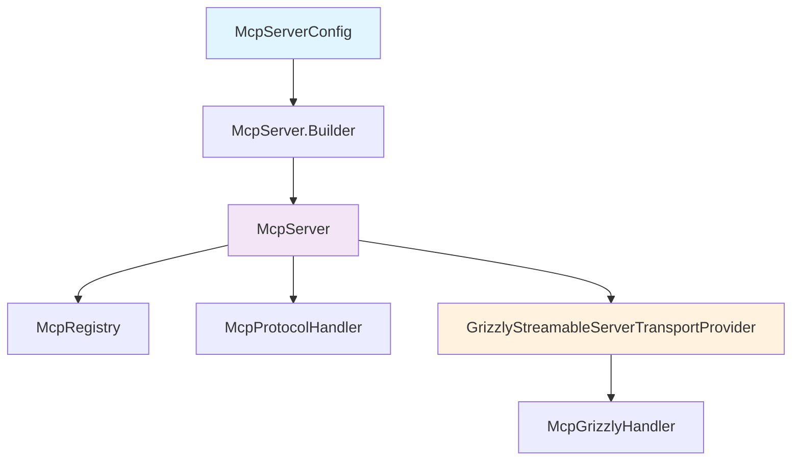

# MCP Java SDK — Project Guide

## 1. Purpose

`mcp-java-sdk` is an independent, portable MCP server SDK targeting Java 8. It is separated from Android, ROSA (Robot Operating System Android), and application-specific services.

The implementation baseline is MCP `2025-11-25`. MCP `2026-07-28` is used only as a comparison reference; the SDK does not claim full support for that version.

The SDK currently provides a practical subset:

- JSON-RPC 2.0 request and notification dispatch;
- MCP initialisation and protocol-version validation;
- tools, resources, resource templates, and prompts;
- Grizzly Streamable HTTP transport;
- session headers and basic lifecycle management;
- annotation-based reflection registration;
- a Java 8-compatible server bootstrap.

The SDK is not a full MCP implementation. Unsupported or unverified features are listed in section 8.

The package contains MCP core and Grizzly HTTP transport only. WebSocket is not a package capability; a robot or application may connect through an external WebSocket bridge or adapter when required.

## 2. Directory structure

```text
src/main/java/io/github/vinhphan812/mcp/
├── annotations/       Runtime annotations for tools, resources, prompts, parameters
├── api/                Public contracts and configuration
│   ├── spi/            Registration SPI and lifecycle listeners
│   │   ├── McpRegistrar, McpResourceUpdateListener, McpRegistryChangeListener
│   ├── handler/        Tool, resource, prompt, completion handler interfaces
│   │   ├── McpToolHandler, McpResourceHandler, McpBlobResourceHandler,
│   │   ├── McpPromptHandler, McpCompletionProvider
│   ├── dto/            Immutable value objects
│   │   ├── McpTask, McpBlobContent
│   ├── config/         Server and client configuration
│   │   ├── McpServerConfig, McpClientCapabilities
│   ├── logging/         Logging adapters
│   │   ├── McpLogger, JulMcpLogger
│   └── McpReflectionRegistrar.java   Annotation-based registration utility
├── core/               Registry, protocol dispatch, server facade
│   ├── McpServer, McpRegistry, McpProtocolHandler
└── transport/          Grizzly HTTP adapter and lifecycle provider
    ├── GrizzlyStreamableServerTransportProvider, McpGrizzlyHandler

src/test/java/io/github/vinhphan812/mcp/
└── Behaviour and live HTTP tests

examples/src/main/java/.../examples/
└── GrizzlyExample.java

docs/
├── PROJECT-GUIDE.md
├── API-REFERENCE.md
├── GRIZZLY-EXAMPLE.md
├── IMPLEMENTATION-STATUS.md
├── MCP-COMPATIBILITY-2026.md
├── MCP-PORTING-PLAN.md
├── adr/                Architecture Decision Records
└── audits/
    └── 2026-09-01-full-source-audit.md
```

## 3. Package architecture

The package split is intentionally small and clean:

- `annotations/` contains runtime metadata only (`@McpTool`, `@McpParam`, `@McpResource`, `@McpResourceTemplate`, `@McpPrompt` and provider markers). It has no transport or registry policy.
- `api/spi/` defines registration contracts (`McpRegistrar`) and listeners that the server fires when registrations or resources change.
- `api/handler/` defines the interfaces applications implement to provide tool, resource, prompt, and completion behaviour.
- `api/dto/` holds immutable value objects that flow through the protocol (tasks, blob content).
- `api/config/` holds server and client configuration (`McpServerConfig`, `McpClientCapabilities`).
- `api/logging/` provides a portable logger interface and a JDK-logging adapter.
- `api/McpReflectionRegistrar.java` is a runtime utility that scans `@Tools`, `@Resources`, and `@Prompts` providers and registers their annotated methods.
- `core/` contains protocol dispatch, registry state, and the server facade. It translates public registrations into MCP JSON-RPC behaviour but does not own HTTP-specific request handling.
- `transport/` contains the Grizzly Streamable HTTP adapter and lifecycle provider. Keeping it isolated permits a future transport adapter without moving protocol or annotation code.

This arrangement keeps dependency direction clear: annotations describe providers; API exposes extension points; core owns MCP semantics; transport adapts network I/O. Intentionally excluded are Android application services, robot/domain models, WebSocket and STDIO implementations, persistence, authentication backends, and broad framework abstractions. Those belong in consuming applications or separate adapters. The standalone example is under `examples/`, not a production package.

## 4. Runtime and dependencies

- Java source/target: 8
- Build tool: Gradle Wrapper
- Gson: `2.11.0`
- Grizzly HTTP server: `4.0.2`
- Default bind address: `127.0.0.1`
- Default port: `3011`
- Default endpoint: `/mcp`

Do not put credentials, API keys, tokens, passwords, or connection strings in source, tests, examples, or documentation. Use `[REDACTED]` for sensitive example values.

## 4. Hosting an MCP server in an Android application

An Android application can embed the SDK and host an MCP server in its own process. The consuming application is responsible for:

1. creating `McpServer`;
2. registering tools, resources, and prompts;
3. selecting the bind address, port, and endpoint;
4. starting the server within the appropriate application lifecycle;
5. making the endpoint available to an MCP client on the same device or a permitted network;
6. calling `stop()`/`close()` when the application or service stops.

The bind configuration for a device or network must be assessed separately. The default `127.0.0.1` permits local access only. Binding to a network is not automatically safe and requires suitable authentication, an Origin allowlist, request-body limits, network policy, and lifecycle controls.

This is an architectural integration path, not evidence that the bundled Grizzly transport runs on every Android API level. Before production use, verify dependency resolution, Java bytecode/desugaring, startup and shutdown, real HTTP requests, application lifecycle behaviour, and network security policy on the target API level and device. This repository has no Android device/emulator evidence and makes no Android API 21 compatibility claim. Grizzly is a JVM/server-oriented dependency; if it is unsuitable for the target Android runtime, the consumer must provide another transport through the public API.

## 5. Server startup flow



Providers are registered before `start()`:

Providers are registered before `start()`:

```java
McpServer server = McpServer.builder()
        .config(McpServerConfig.builder()
                .serverName("my-server")
                .serverVersion("1.0.0")
                .protocolVersion("2025-11-25")
                .tools(true)
                .resources(true)
                .prompts(true)
                .build())
        .host("127.0.0.1")
        .port(3011)
        .endpoint("/mcp")
        .build()
        .register(new MyTools())
        .register(new MyResources());

server.start();
System.out.println(server.getUrl());
// shutdown: server.close()
```

Use `port(0)` in tests to request an ephemeral port from the operating system. After startup, retrieve the actual port with `server.getTransport().getActualPort()`.

Lifecycle methods:

- `register(...)`: register a provider before startup;
- `registerAll(...)`: register multiple providers in order;
- `start()`: start Grizzly;
- `isRunning()`: inspect the running state;
- `getUrl()`: obtain the endpoint while the server is running;
- `stop()`/`close()`: stop the server and close sessions.

## 6. Capability registration

The reflection registrar reads these annotations:

- `@Tools` + `@McpTool`;
- `@Resources` + `@McpResource`;
- `@Resources` + `@McpResourceTemplate`;
- `@Prompts` + `@McpPrompt`;
- `@McpParam` for argument metadata, schemas, and direct parameter binding.

The complete runnable catalogue, request payloads, capability settings, run commands, and limitations are documented in `docs/GRIZZLY-EXAMPLE.md`. It registers three tools, two exact resources, two resource templates, and two prompts.

When a tool or prompt method has one `Map<String, Object>` parameter, the map is passed through unchanged. When parameters are individually annotated with `@McpParam`, JSON argument values are bound by name and converted to supported Java 8 scalar types (`String`, boolean, and numeric primitives/wrappers). Required values and types are checked before invocation.

Current contracts:

- tool methods return `Map<String, Object>`;
- prompt methods return `Map<String, Object>`;
- resource and resource-template methods return `String`;
- tool and prompt methods accept zero arguments, one compatible `Map<String, Object>` argument, or individually annotated direct parameters;
- direct `@McpParam` parameters are bound by name and support String, boolean, numeric primitive/wrapper, Object, and Map values;
- resource arguments are normally URI `String` values.

The registrar checks return types and throws `IllegalArgumentException` when a method violates the contract. For large production deployments, consider a generated registrar instead of reflection to reduce startup cost and improve determinism.

## 7. Package architecture assessment

The package layout under `io.github.vinhphan812.mcp` is appropriate for the current SDK boundary and should not be flattened or split further without a new capability requiring it:

- `annotations`: public annotation declarations only; no protocol or transport dependency.
- `api`: public extension contracts, configuration, handlers, logger, completion provider, and task/client metadata types.
- `core`: registry, JSON-RPC dispatch, session state, capability advertisement, and server facade; it is transport-neutral.
- `transport`: Grizzly HTTP lifecycle, headers, authentication, Origin policy, SSE, and request limits; HTTP-specific concerns remain isolated here.

Keeping `core` independent of `transport` allows another transport to use the same protocol handler. Keeping `api` separate from `core` makes the public integration surface explicit. WebSocket, Android services, robot/application domain models, persistence, and generated registrars are intentionally outside these packages.

The example application is kept under `examples/.../examples` and is not part of the SDK artifact.

## 8. Protocol flow

The client sends `initialize` using JSON-RPC 2.0:

```json
{
  "jsonrpc": "2.0",
  "id": 1,
  "method": "initialize",
  "params": {
    "protocolVersion": "2025-11-25",
    "capabilities": {},
    "clientInfo": {"name": "client", "version": "1.0.0"}
  }
}
```

The client then sends this notification:

```json
{"jsonrpc":"2.0","method":"notifications/initialized"}
```

Notifications have no `id` and receive no JSON-RPC response body. Ordinary requests have an `id` and receive a response or error.

Main methods:

- `initialize`;
- `tools/list`, `tools/call`;
- `resources/list`, `resources/read`;
- `resources/templates/list`;
- `prompts/list`, `prompts/get`.

A resource template does not use a custom route. The client resolves a URI, such as `demo://users/42`, and then calls `resources/read`.

Protocol failures use JSON-RPC errors, including invalid requests or parameters and unknown methods or resources. The SDK does not treat an application error as a successful result containing an error string.

## 9. HTTP transport

The endpoint handles:

- `POST /mcp`: JSON-RPC request or notification;
- `GET /mcp`: basic session-bound event stream;
- `DELETE /mcp`: session termination.

Relevant headers:

- POST requires `Content-Type: application/json`;
- `Accept` must allow `application/json` and/or `text/event-stream`;
- protocol header: `Mcp-Protocol-Version: 2025-11-25`;
- session header: `Mcp-Session-Id` after a session is issued;
- optional authentication: `Authorization: Bearer [REDACTED]`.

Security defaults:

- examples bind to loopback;
- an unknown or disallowed Origin is rejected;
- Bearer tokens are compared in constant time;
- the secret is supplied by `Supplier<String>` and must not be written to logs or source.

Production deployment should add a reverse proxy, request limits, TLS, an appropriate Origin allowlist, and a secret provider outside source control.

## 9. Unsupported or unverified scope

The following features are not implemented or have not been fully demonstrated:

- progress/cancellation notifications (implemented: `notifyToolProgress`, `notifications/cancelled`, `isCancelled` — P2);
- sampling (not implemented);
- elicitation request/response flow (not implemented);
- async task orchestration and `tasks/create` (implemented — P2);
- async server API (not implemented);
- STDIO transport;
- typed schema model beyond `@McpTool(outputSchema)`;
- POST event-stream response mode (results returned as JSON);
- complete CORS policy beyond Origin rejection;
- external MCP client interoperability;
- Android/ROSA device or emulator startup evidence.

Do not describe the SDK as having full MCP parity while these limitations remain.

## 10. Build, tests, and example

The build creates one Maven publication with artifact `io.github.vinhphan812.mcp:mcp-java-sdk` and main, sources, and Javadoc JARs. CI and release workflows are configured, but no tagged release or publication has been executed.

From the project root:

```bash
./gradlew clean test build --console=plain
```

Current tests cover:

- configuration defaults and validation;
- JSON-RPC dispatch and error/notification behaviour;
- annotation registration and direct binding;
- tasks (get, result, cancel, progress, notFound);
- pagination (cursor-based);
- list-changed notifications;
- in-process Grizzly HTTP smoke, security matrix, and resumability paths;
- Bearer token authentication matrix.

The example is not declared as a separate Gradle source set or application task. Run it with a suitable Gradle classpath or add a separate build task in a different change.

Detailed request guidance is in `docs/GRIZZLY-EXAMPLE.md`.

## 11. Audit and release checklist

Before release:

1. run `./gradlew clean test build --console=plain`;
2. inspect test reports and the exit code;
3. run a static search for Android/application imports;
4. check for real secrets or credentials;
5. review the existing audit documentation and update its date and scope;
6. review dependency notices or an SBOM as required for the release;
7. check Origin, TLS, body-size limits, authentication, and reverse-proxy configuration;
8. confirm client interoperability with runtime HTTP probes.

## 12. Reference documentation

- `README.md`: quick overview;
- `docs/API-REFERENCE.md`: complete public API surface with all annotations, handlers, and methods;
- `docs/GRIZZLY-EXAMPLE.md`: transport and example walkthrough;
- `docs/MCP-COMPATIBILITY-2026.md`: compatibility matrix and remediation history;
- `docs/MCP-PORTING-PLAN.md`: portable extraction plan;
- `docs/IMPLEMENTATION-STATUS.md`: completed, incomplete, and unverified areas with test evidence;
- `docs/adr/`: architecture decision records (ADRs) documenting key design choices.
- `docs/audits/2026-09-01-full-source-audit.md`: full source audit.
