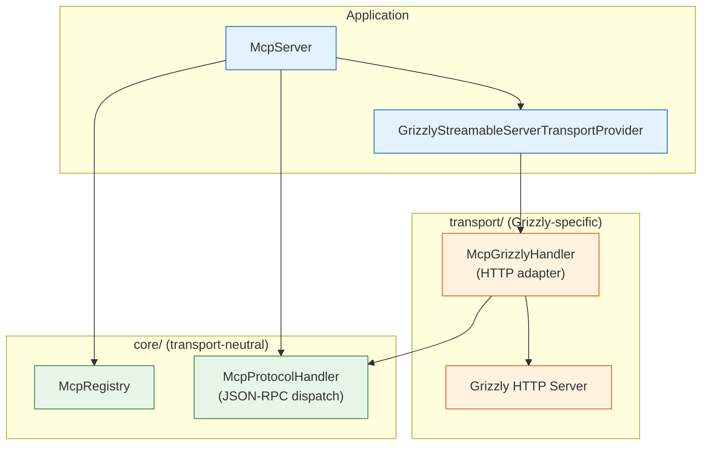
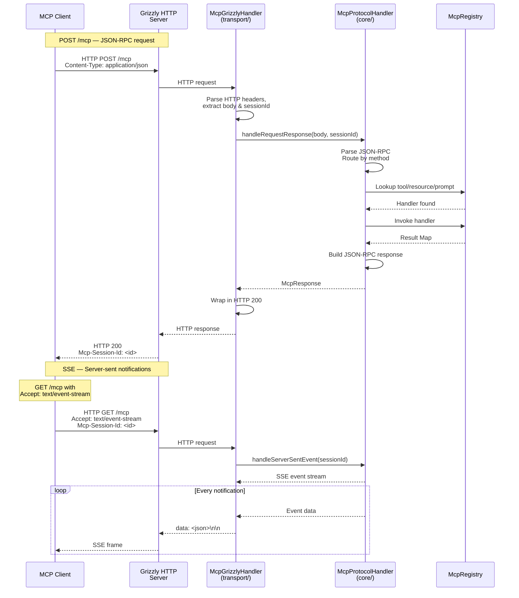

# ADR-0002 — Grizzly Transport Isolation

**Status:** Accepted
**Date:** 2026-09-01
**Authors:** MCP Java SDK team

## Context

The SDK provides an MCP server that communicates over HTTP using the Model Context Protocol Streamable HTTP transport.
Grizzly was chosen because it supports Java 8 and does not require external native dependencies. However, Grizzly is a
server-oriented dependency; it may not be suitable for all runtime environments, particularly Android.

## Decision

The `transport/` package is isolated from `core/`. The `McpServer` composes:

The public `McpRegistrar` SPI is the boundary between application code and the protocol layer. Any transport
implementation can consume the same registry and protocol handler without importing Grizzly.

## Request/response flow

### Flow explanation

| Step | Layer        | What happens                                                            |
|------|--------------|-------------------------------------------------------------------------|
| 1    | `transport/` | `GrizzlyServer` receives HTTP request                                   |
| 2    | `transport/` | `McpGrizzlyHandler` parses HTTP: headers, body, session ID              |
| 3    | `core/`      | `McpProtocolHandler` parses JSON-RPC envelope, routes by method         |
| 4    | `core/`      | `McpRegistry` looks up the registered tool, resource, or prompt handler |
| 5    | `core/`      | Handler executes; result is a `Map<String, Object>`                     |
| 6    | `core/`      | `McpProtocolHandler` wraps result in a JSON-RPC 2.0 response            |
| 7    | `transport/` | `McpGrizzlyHandler` wraps `McpResponse` in an HTTP response             |
| 8    | `transport/` | `GrizzlyServer` sends HTTP response to client                           |

For SSE, `McpGrizzlyHandler` calls `handleServerSentEvent` which streams `data: <json>\n\n` frames
back through the Grizzly server to the client.

## Consequences

**Positive:**

- A consumer can replace Grizzly with STDIO, Netty, a custom HTTP server, or an Android-specific transport by providing
  an alternative adapter that consumes `McpRegistrar`.
- The `core/` package is transport-neutral and can be tested in isolation.
- The Grizzly transport is pluggable: it is constructed and injected by `McpServer`, not hard-coded into the protocol
  handler.

**Negative:**

- The current distribution includes Grizzly in the artifact; consumers that cannot use Grizzly must shade or exclude it.
- No STDIO or Android-specific transport is provided in this package.
- WebSocket is not implemented; an external bridge or adapter is required when WebSocket integration is needed.

## Alternatives considered

- **STDIO as default transport:** Rejected because STDIO is request-response only and does not support server-initiated
  notifications (SSE). It is suitable for CLI tools but not for the streamable HTTP use case.
- **Embedded Jetty:** Jetty requires more configuration for HTTP/2 and SSE; Grizzly has built-in SSE support.
- **Custom NIO socket:** Rejected to avoid reinventing HTTP handling, session management, and keep-alive logic.
