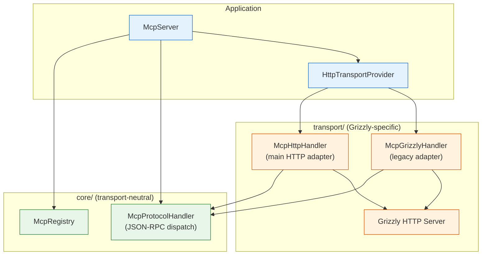

# ADR-0002 — Grizzly Transport Isolation

**Status:** Accepted
**Date:** 2026-09-01
**Updated:** 2026-09-23
**Authors:** MCP Java SDK team

## Context

The SDK provides an MCP server that communicates over HTTP using the Model Context Protocol. Grizzly was chosen
because it supports Java 8 and does not require external native dependencies. However, Grizzly is a server-oriented
dependency; it may not be suitable for all runtime environments, particularly Android.

## Decision

The `transport/` package is isolated from `core/`. The architecture consists of:

- **`HttpTransportProvider`** — public entry point, `AutoCloseable`. Exposes a builder API for configuration
  (host, port, endpoint, API key, CORS, transport mode). Creates and manages the Grizzly HTTP server lifecycle.
- **`McpHttpHandler`** — HTTP adapter (extends Grizzly `HttpHandler`). Handles POST (JSON-RPC), GET (SSE replay),
  and DELETE (session close) at the Grizzly layer. Delegates to `McpProtocolHandler` for protocol logic.
- **`McpGrizzlyHandler`** — legacy HTTP adapter (extends Grizzly `HttpHandler`). Kept for backward compatibility
  but **`HttpTransportProvider` uses `McpHttpHandler` by default**.
- **`TransportMode`** — enum selecting between `AUTO` (protocol-driven), `HTTP_SSE` (legacy dual-endpoint),
  and `STREAMABLE_HTTP` (modern single-endpoint).



The public `McpRegistrar` SPI is the boundary between application code and the protocol layer. Any transport
implementation can consume the same registry and protocol handler without importing Grizzly.

## Class Reference

| Class | Package | Role |
|-------|---------|------|
| `HttpTransportProvider` | `transport/` | Public entry point, builder API, server lifecycle |
| `McpHttpHandler` | `transport/` | Main HTTP adapter (POST/GET/DELETE); SSE streaming in `handleGet()` |
| `McpGrizzlyHandler` | `transport/` | Legacy HTTP adapter; kept for backward compatibility |
| `TransportMode` | `transport/` | Enum: `AUTO`, `HTTP_SSE`, `STREAMABLE_HTTP` |

## Request/response flow (McpHttpHandler)

```mermaid
sequenceDiagram
    participant C as MCP Client
    participant G as Grizzly HTTP<br/>Server
    participant H as McpHttpHandler<br/>(transport/)
    participant P as McpProtocolHandler<br/>(core/)
    participant R as McpRegistry

    Note over C,G: POST /endpoint — JSON-RPC request
    C->>G: HTTP POST /endpoint<br/>Content-Type: application/json
    G->>H: HTTP request
    H->>H: Parse HTTP headers,<br/>extract body & sessionId
    H->>P: handleRequestResponse(body, sessionId)
    P->>P: Parse JSON-RPC<br/>Route by method
    P->>R: Lookup tool/resource/prompt
    R-->>P: Handler found
    P->>R: Invoke handler
    R-->>P: Result Map
    P->>P: Build JSON-RPC response
    P-->>H: McpResponse
    H->>H: Wrap in HTTP 200
    H-->>G: HTTP response
    G-->>C: HTTP 200<br/>Mcp-Session-Id: &lt;id&gt;

    Note over C,G: GET /endpoint — SSE event stream
    C->>G: HTTP GET /endpoint<br/>Accept: text/event-stream<br/>Mcp-Session-Id: &lt;id&gt;<br/>Last-Event-ID: &lt;id&gt;
    G->>H: HTTP request
    H->>H: Validate session,<br/>extract Last-Event-ID
    H->>P: handleServerSentEvent(sessionId)
    P-->>H: SSE event stream (id, data, retry)
    loop Every notification
        P-->>H: Event data
        H-->>G: data: &lt;json&gt;\n\n
        G-->>C: SSE frame
    end
```

### Flow explanation

| Step | Layer | What happens |
|------|-------|--------------|
| 1 | `transport/` | `GrizzlyServer` receives HTTP request |
| 2 | `transport/` | `McpHttpHandler` parses HTTP: headers, body, session ID |
| 3 | `core/` | `McpProtocolHandler` parses JSON-RPC envelope, routes by method |
| 4 | `core/` | `McpRegistry` looks up the registered tool, resource, or prompt handler |
| 5 | `core/` | Handler executes; result is a `Map<String, Object>` |
| 6 | `core/` | `McpProtocolHandler` wraps result in a JSON-RPC 2.0 response |
| 7 | `transport/` | `McpHttpHandler` wraps `McpResponse` in an HTTP response |
| 8 | `transport/` | `GrizzlyServer` sends HTTP response to client |

For SSE, `McpHttpHandler.handleGet()` streams `data: <json>\n\n` frames through the Grizzly server to the client.

## Consequences

**Positive:**

- A consumer can replace Grizzly with STDIO, Netty, a custom HTTP server, or an Android-specific transport by providing
  an alternative adapter that consumes `McpRegistrar`.
- The `core/` package is transport-neutral and can be tested in isolation.
- The HTTP transport is pluggable: `HttpTransportProvider` is constructed and injected by `McpServer`, not hard-coded into the protocol handler.
- The `TransportMode` enum allows gradual migration from legacy HTTP+SSE to modern Streamable HTTP.

**Negative:**

- The current distribution includes Grizzly in the artifact; consumers that cannot use Grizzly must shade or exclude it.
- No STDIO or Android-specific transport is provided in this package.
- WebSocket is not implemented; an external bridge or adapter is required when WebSocket integration is needed.

## Alternatives considered

- **STDIO as default transport:** Rejected because STDIO is request-response only and does not support server-initiated
  notifications (SSE). It is suitable for CLI tools but not for the streamable HTTP use case.
- **Embedded Jetty:** Jetty requires more configuration for HTTP/2 and SSE; Grizzly has built-in SSE support.
- **Custom NIO socket:** Rejected to avoid reinventing HTTP handling, session management, and keep-alive logic.
