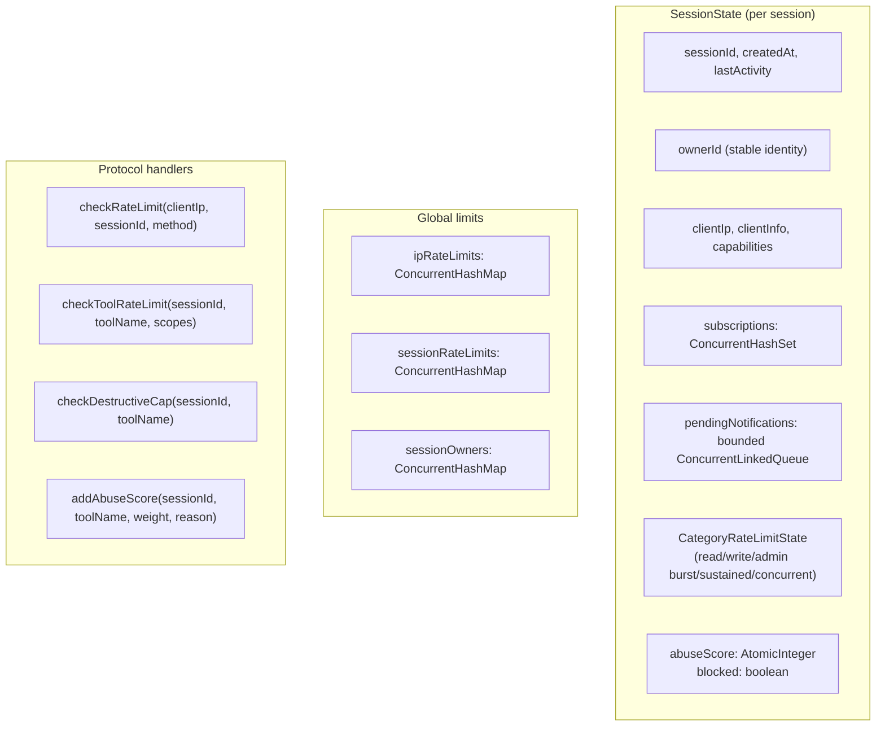

# ADR-0011 — Security and Rate Limiting

**Status:** Accepted
**Date:** 2026-09-14
**Accepted:** 2026-09-14 — all 10 phases implemented.
**Authors:** MCP Java SDK team

## Context

The portable SDK's `McpProtocolHandler` handles session management and protocol dispatch but has no security controls. Any MCP client can call any registered tool without authentication, rate limits, or abuse prevention. The SDK's Android/ROSA host application (`CruzrEnglishAssistant`) has a richer `McpProtocolHandler` with owner-based sessions, per-category rate limiting, destructive tool caps, and abuse scoring. Those features are currently application-specific and not part of the SDK.

## Decision

Port the following security and rate-limiting features from the application-specific implementation into `McpProtocolHandler` in `core/`. All features are Java 8-compatible and require only the existing portable dependencies (Gson, concurrent collections).

## Features

### 1. Owner-based sessions

```
sessionOwners: ConcurrentHashMap<String, String>  // ownerId → sessionId
```

- `initialize` accepts an optional `ownerId` in params.
- One active session per ownerId at a time. Re-initialize with same ownerId replaces the session.
- Session holds a stable `ownerId` field.
- `clearOwnerBinding()` removes the owner binding when session ends.

### 2. Per-category rate limiting

Three categories: `read`, `write`, `admin`. Each session tracks:

| Limit type | Description |
|---|---|
| Burst | Sliding window per minute |
| Sustained | Sliding window per 5 minutes |
| Concurrent | In-flight tool call count cap |

Category is determined by required scopes: any `admin` scope → `admin`; any `write` scope → `write`; otherwise → `read`.

**Constants** (public, configurable via `McpServerConfig`):

| Category | Burst | Sustained | Concurrent cap |
|---|---|---|---|
| read | 60/min | 200/5min | 5 |
| write | 30/min | 100/5min | 3 |
| admin | 5/min | 15/5min | 1 |

### 3. Destructive tool caps

Named destructive tools get lifetime call limits and cooldown periods:

| Tool | Lifetime cap | Cooldown |
|---|---|---|
| `shutdown` | 3 | 10 min |
| `delete_action`, `delete_prompt` | 10 | 2 min |
| `upload_file` | 5 | 1 min |

### 4. Abuse scoring

- Each rate-limit violation adds a weighted score to the session.
- `ABUSE_SCORE_BLOCK_THRESHOLD = 10`.
- When score >= threshold, session is blocked. All subsequent tool calls return error until session expires.
- Logged at WARN/CRITICAL/SEVERE levels.

### 5. Queue overflow handling

`SessionState` uses a `ConcurrentLinkedQueue<String>` bounded to `MAX_PENDING_NOTIFICATIONS_PER_SESSION = 100`.

- Overflow calls `QueueOverflowListener.onOverflow(sessionId)` if registered.
- If no listener, throws `QueueOverflowException extends RuntimeException`.

```java
public interface QueueOverflowListener {
    void onOverflow(String sessionId);
}
```

### 6. IP-based rate limiting

- `ipRateLimits: ConcurrentHashMap<String, RateLimitRecord>` — per client IP.
- `MAX_REQUESTS_PER_IP_PER_MINUTE = 60`.
- `MAX_REQUESTS_PER_SESSION_PER_MINUTE = 120` for session-level.

### 7. Max concurrent sessions

- `MAX_CONCURRENT_SESSIONS = 10` — `initialize` returns `-32029` if limit reached.

### 8. Input schema validation

Before invoking a tool handler, validate required params against the registered `inputSchema`:

```java
List<String> missing = ...;
for (String required : requiredParams) {
    if (!arguments.containsKey(required) || arguments.get(required) == null) {
        missing.add(required);
    }
}
if (!missing.isEmpty()) {
    return errorToolResult("Missing required parameter(s): " + missing);
}
```

### 9. Authorization integration

The existing `McpAuthorization` class from `security/` package provides scope checking. `handleToolsCall` calls `McpAuthorization.denial(requiredScopes, confirmationRequired, arguments)` before invoking the handler.

### 10. Credential rotation

```java
public void onCredentialRotated() {
    closeAllSessions();
}
```

Called by the credential manager when the API key is rotated. All active sessions are invalidated immediately.

## Architecture



## Data structures

```java
// Per session
static final class CategoryRateLimitState {
    // 6 sliding-window records
    RateLimitRecord readBurst, readSustained;
    RateLimitRecord writeBurst, writeSustained;
    RateLimitRecord adminBurst, adminSustained;
    // In-flight counters
    AtomicInteger readConcurrent, writeConcurrent, adminConcurrent;
    // Destructive counters
    AtomicInteger shutdownCount, deleteCount, uploadCount;
    volatile long shutdownLastMs, deleteLastMs, uploadLastMs;
    // Abuse
    AtomicInteger abuseScore;
    volatile boolean blocked;
}

// Sliding-window rate limit record
private static class RateLimitRecord {
    ConcurrentLinkedQueue<Long> requestTimestamps;
    boolean allowRequest(int maxRequests, long windowMs);
    int getRequestCount(long windowMs);
}
```

## Dependencies

No new external dependencies. Uses existing:
- `java.util.concurrent.ConcurrentHashMap`, `ConcurrentLinkedQueue`, `AtomicInteger`
- `com.google.gson.Gson`
- Existing `McpServerConfig`, `McpAuthorization`

## Configuration

All limits are public constants in `McpProtocolHandler` and overridable via `McpServerConfig`. The config builder accepts optional rate-limit overrides:

```java
McpServerConfig.builder()
    .serverName("my-server")
    .serverVersion("1.0.0")
    // Rate limit overrides
    .maxConcurrentSessions(10)
    .maxRequestsPerIpPerMinute(60)
    .categoryRateLimits(readBurst, readSustained, ...)
    .build()
```

## Consequences

**Positive:**
- SDK consumers get enterprise-grade security out of the box.
- Owner-based sessions prevent a single client from holding multiple sessions.
- Rate limiting protects against abuse and runaway clients.
- Destructive tool caps prevent catastrophic operations.
- Abuse scoring automates session blocking without manual intervention.
- Queue overflow handling prevents memory exhaustion from notification floods.

**Negative:**
- Increased complexity in `McpProtocolHandler` (currently ~1200 lines, will grow).
- More public constants to document.
- Testing surface increases significantly.
- Config builder needs new overloads for rate-limit overrides.

**Alternatives considered:**
- Keep security in the application layer only — rejected because every consumer must re-implement the same controls.
- Use a third-party rate-limiting library — rejected to keep the SDK dependency-free and portable.
