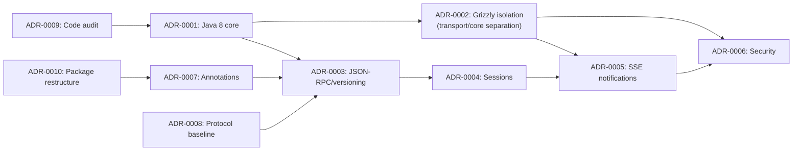

# Architecture Decision Records

This directory contains Architecture Decision Records (ADRs) for the MCP Java SDK project.

ADRs document significant design decisions, the context that motivated them, and their consequences. They serve as a
permanent record of why the system is built the way it is.

See
also: [PROJECT-GUIDE.md](../PROJECT-GUIDE.md) | [API-REFERENCE.md](../API-REFERENCE.md) | [IMPLEMENTATION-STATUS.md](../IMPLEMENTATION-STATUS.md)

## ADR relationship

## Index

| ID                                                            | Title                                                                    | Status   | Date       |
|---------------------------------------------------------------|--------------------------------------------------------------------------|----------|------------|
| [ADR-0001](ADR-0001-portable-java8-core.md)                   | Portable Java 8 Core Without Android SDK                                 | Accepted | 2026-09-01 |
| [ADR-0002](ADR-0002-grizzly-transport-isolation.md)           | Grizzly Transport Isolation                                              | Accepted | 2026-09-01 |
| [ADR-0003](ADR-0003-json-rpc-envelope-protocol-versioning.md) | JSON-RPC 2.0 Envelope, Protocol Versioning, and Capability Advertisement | Accepted | 2026-09-01 |
| [ADR-0004](ADR-0004-session-management.md)                    | Session Management and Lifecycle                                         | Accepted | 2026-09-01 |
| [ADR-0005](ADR-0005-sse-notifications-event-queue.md)         | Server-Initiated Notifications via SSE Event Queue                       | Accepted | 2026-09-01 |
| [ADR-0006](ADR-0006-security-model.md)                        | Security Model: Origin, Authentication, and Input Validation             | Accepted | 2026-09-01 |
| [ADR-0007](ADR-0007-annotation-registration.md)               | Annotation-Based Registration with Reflection Registrar                  | Accepted | 2026-09-01 |
| [ADR-0008](ADR-0008-protocol-baseline-compatibility.md)       | Protocol Baseline and Compatibility Scope                                | Accepted | 2026-09-01 |
| [ADR-0009](ADR-0009-code-audit-2026-09-11.md)                 | Code Audit Findings (2026-09-11)                                         | Accepted | 2026-09-11 |
| [ADR-0010](ADR-0010-api-package-restructure.md)               | `api/` Package Restructure by Category                                   | Accepted | 2026-09-11 |

## When to create an ADR

Create an ADR when a decision:

1. Affects the API surface or public contracts.
2. Introduces a new transport, protocol, or architectural pattern.
3. Changes the dependency model (e.g. adding or removing a dependency).
4. Has significant consequences for consumers (e.g. breaking changes, new requirements).
5. Was made as a trade-off between competing concerns.

Routine refactoring, bug fixes, and documentation changes do not need ADRs.

## ADR format

Each ADR follows the [Michael Nygard format](https://cognitect.com/blog/2011/11/15/documenting-architecture-decisions):

1. **Title** — concise description.
2. **Status** — `Proposed`, `Accepted`, `Deprecated`, or `Superseded`.
3. **Context** — the situation that motivated the decision.
4. **Decision** — what was decided.
5. **Consequences** — what becomes better, worse, or different as a result.
6. **Alternatives considered** — what other options were evaluated and why they were rejected.
