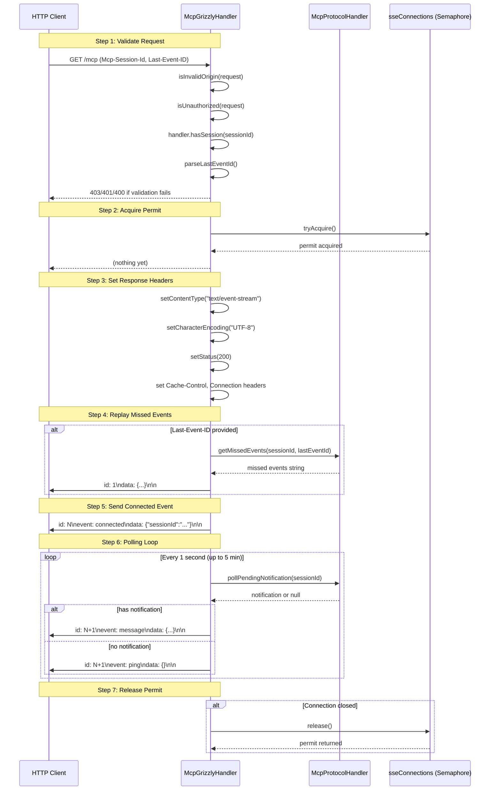
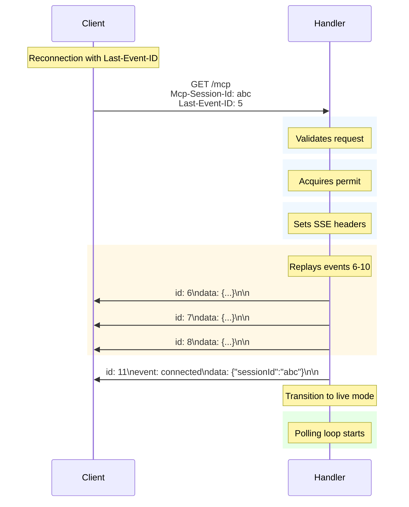

# MCP Transport — SSE Connection Flow

This document describes the Server-Sent Events (SSE) transport implementation in the MCP Java SDK, specifically the
`McpGrizzlyHandler` class and its connection management semantics.

## Overview

The SDK uses Grizzly HTTP server as its transport layer. `McpGrizzlyHandler` handles two HTTP methods:

- **POST /mcp** — JSON-RPC request/response for client-to-server RPC
- **GET /mcp** — SSE stream for server-to-client notifications

This document focuses on the SSE connection flow.

## SSE Connection Lifecycle



## Connection Limit

The SSE connection limit is enforced via a `Semaphore`:

- **Default limit:** 4 concurrent SSE connections
- **Configurable:** Pass `maxSseConnections` to the constructor

```java
// Default: 4 connections
McpGrizzlyHandler handler = new McpGrizzlyHandler(protocolHandler);

// Custom: 10 connections
McpGrizzlyHandler handler = new McpGrizzlyHandler(
        protocolHandler,
        "/mcp",
        null,                              // apiKeySupplier
        DEFAULT_ALLOWED_ORIGINS,
        1024 * 1024,                       // maxRequestBodyBytes
        10,                                // maxSseConnections
        false                              // trustXForwardedFor
);
```

## Required Operation Sequence

The SSE connection flow MUST follow this exact order:

### 1. Validate Request

Before any I/O or permit acquisition, validate:

- **Origin:** Must be in `allowedOrigins` (checked via `Origin` header)
- **Authorization:** Must provide valid `Authorization: Bearer <apiKey>` if API key is configured
- **Session:** Must provide valid `Mcp-Session-Id` header referencing an active session

If any validation fails, return an error immediately without acquiring a permit or writing any response body.

### 2. Acquire Permit

Call `sseConnections.tryAcquire()` BEFORE any response output.

- If acquisition fails (semaphore has no permits), return HTTP 429 error
- If acquisition succeeds, the connection is now "active" and counted toward the limit

### 3. Set Response Headers

Only after permit is acquired, set SSE-specific headers:

```
Content-Type: text/event-stream
Character-Encoding: UTF-8
Cache-Control: no-cache, no-transform
Connection: keep-alive
Status: 200
```

### 4. Replay Missed Events (if Last-Event-ID provided)

If the client sends `Last-Event-ID` header, replay any events they missed:

```
GET /mcp HTTP/1.1
Mcp-Session-Id: abc123
Last-Event-ID: 5
```

The handler calls `handler.getMissedEvents(sessionId, lastEventId)` and writes the result as SSE events.

### 5. Send Connected Event

After replay (or immediately if no replay), send the connected event:

```
id: <nextId>
event: connected
data: {"sessionId":"abc123"}
```

This signals the client that the connection is now in "live" mode.

### 6. Enter Polling Loop

Enter the notification polling loop:

- Sleep 1 second
- Poll `handler.pollPendingNotification(sessionId)`
- If notification exists: send as `message` event
- If no notification: send `ping` event
- Flush output
- Repeat until timeout (5 minutes), interrupt, or session end

### 7. Release Permit

In a `finally` block, always release the permit:

```java
try{
        // ... connection handling
        }finally{
        if(permitHeld){
        sseConnections.

release();
    }
            }
```

This ensures permits are returned regardless of how the connection ends.

## 429 Response Contract

When SSE connection permits are exhausted (`tryAcquire()` returns false), the handler returns:

```json
HTTP/1.1 429 Too Many Requests
Content-Type: application/json
X-RateLimit-Limit: <maxConnections>
X-RateLimit-Remaining: 0
X-RateLimit-Reset: <unixTimestamp>

{
"jsonrpc": "2.0",
"id": null,
"error": {
"code": 429,
"message": "Too many active SSE connections"
}
}
```

The response includes standard rate limit headers:

| Header                  | Description                                         |
|-------------------------|-----------------------------------------------------|
| `X-RateLimit-Limit`     | Maximum concurrent SSE connections (from semaphore) |
| `X-RateLimit-Remaining` | Always 0 when limit is exhausted                    |
| `X-RateLimit-Reset`     | Unix timestamp when a permit may become available   |

The 429 response is returned BEFORE any response body has been written, ensuring a clean error without stream
corruption.

## Last-Event-ID Replay Behavior

Clients can resume from a disconnection point using the `Last-Event-ID` header:

### Request Format

```
GET /mcp HTTP/1.1
Mcp-Session-Id: abc123
Last-Event-ID: 42
```

### Handler Behavior

1. Parse `Last-Event-ID` as a non-negative long integer
2. If parsing fails (non-numeric, negative), return HTTP 400 with error message
3. Call `handler.getMissedEvents(sessionId, lastEventId)` to get missed events
4. Write events to the response AFTER headers are set and permit is acquired

### Event IDs

- Events sent during replay have sequential IDs starting from `lastEventId + 1`
- The `connected` event has the next ID after any replayed events
- The polling loop continues with incrementing IDs

### Sequence Diagram: Replay



## Error Responses

The handler returns structured error responses:

| Status | Condition                                                     |
|--------|---------------------------------------------------------------|
| 400    | Missing/invalid session ID, invalid Last-Event-ID, empty body |
| 401    | Missing or invalid Authorization header                       |
| 403    | Origin not in allowed origins                                 |
| 404    | Unknown endpoint, unknown session (DELETE)                    |
| 405    | Unsupported HTTP method                                       |
| 413    | Request body exceeds `maxRequestBodyBytes`                    |
| 415    | Content-Type must be application/json                         |
| 406    | Accept must include application/json and text/event-stream    |
| 429    | Too many SSE connections (semaphore exhausted)                |

All errors follow JSON-RPC error response format:

```json
{
  "jsonrpc": "2.0",
  "id": null,
  "error": {
    "code": <status>,
    "message": "<human-readable message>"
  }
}
```

## Configuration Options

### Constructor Parameters

| Parameter             | Type                 | Default                                     | Description                           |
|-----------------------|----------------------|---------------------------------------------|---------------------------------------|
| `handler`             | `McpProtocolHandler` | (required)                                  | Protocol handler instance             |
| `endpoint`            | `String`             | `/mcp`                                      | HTTP endpoint path                    |
| `apiKeySupplier`      | `Supplier<String>`   | `null`                                      | Optional API key validator            |
| `allowedOrigins`      | `Set<String>`        | `{localhost, 127.0.0.1, https://localhost}` | Allowed CORS origins                  |
| `maxRequestBodyBytes` | `int`                | 1 MB                                        | Maximum POST body size                |
| `maxSseConnections`   | `int`                | 4                                           | Concurrent SSE limit                  |
| `trustXForwardedFor`  | `boolean`            | `false`                                     | Use X-Forwarded-For for rate limiting |

### Setting Custom Origins

```java
Set<String> origins = new HashSet<>(Arrays.asList(
        "http://localhost",
        "http://127.0.0.1",
        "https://example.com"
));

McpGrizzlyHandler handler = new McpGrizzlyHandler(
        protocolHandler,
        "/mcp",
        () -> "secret-api-key",  // API key supplier
        origins,
        1024 * 1024,            // 1 MB max body
        10,                     // 10 concurrent SSE
        true                    // trust X-Forwarded-For
);
```

## Connection State Diagram

```
                    ┌─────────────────┐
                    │     START       │
                    └────────┬────────┘
                             │
                    ┌────────▼────────┐
                    │   VALIDATING    │
                    │  (origin, auth, │
                    │   session, ID)  │
                    └────────┬────────┘
                             │
              ┌──────────────┴──────────────┐
              │                             │
     ┌────────▼────────┐          ┌───────▼───────┐
     │   VALIDATION     │          │  VALIDATION   │
     │    FAILED       │          │    PASSED     │
     │  (error sent)   │          └───────┬───────┘
     └────────┬────────┘                  │
              │                   ┌────────▼────────┐
              │                   │   ACQUIRING    │
              │                   │    PERMIT      │
              │                   └────────┬────────┘
              │                            │
     ┌────────▼────────┐         ┌────────▼────────┐
     │    TERMINAL      │         │    ACQUIRE      │  ACQUIRE FAIL
     │   (COMPLETE)    │         │    SUCCESS     │  (429 error)
     └─────────────────┘         └────────┬────────┘
                                         │
                                ┌────────▼────────┐
                                │   SET HEADERS   │
                                │  (200, SSE)    │
                                └────────┬────────┘
                                         │
              ┌──────────────────────────┴──────────────────────────┐
              │                                                       │
     ┌────────▼────────┐                                 ┌─────────▼────────┐
     │   REPLAY EVENTS │                                 │   NO REPLAY      │
     │ (if LastEventId)│                                 │   (first conn)   │
     └────────┬────────┘                                 └────────┬─────────┘
              │                                                    │
              │                                           ┌────────▼────────┐
              │                                           │  SEND CONNECTED │
              │                                           │      EVENT      │
              │                                           └────────┬────────┘
              │                                                    │
              └────────────────────┬────────────────────────────────┘
                                   │
                          ┌────────▼────────┐
                          │   CONNECTED /   │
                          │     POLLING     │
                          │  (notification  │
                          │     loop)       │
                          └────────┬────────┘
                                   │
              ┌─────────────────────┼─────────────────────┐
              │                     │                     │
     ┌────────▼────────┐  ┌────────▼────────┐  ┌─────────▼────────┐
     │    TIMEOUT      │  │  INTERRUPTED   │  │  SESSION END    │
     │  (5 min idle)  │  │  (client disconnect)│  │ (handler.end) │
     └────────┬────────┘  └────────┬────────┘  └────────┬─────────┘
              │                    │                    │
              └────────────────────┼────────────────────┘
                                   │
                          ┌────────▼────────┐
                          │  RELEASE PERMIT │
                          │   (finally)     │
                          └────────┬────────┘
                                   │
                          ┌────────▼────────┐
                          │   TERMINAL      │
                          │   (COMPLETE)   │
                          └─────────────────┘
```

## Thread Safety

- The `Semaphore` is thread-safe for permit acquisition/release
- Each SSE connection runs in its own request thread
- The `McpProtocolHandler` manages session state (typically thread-safe)

## TLS Transport (Reverse Proxy Termination)

The MCP Java SDK uses **plain HTTP** for its transport layer. TLS is **not** handled in-process by the SDK. Instead, TLS
must be terminated at a reverse proxy (nginx, Apache, cloud load balancer, or Kubernetes ingress).

### Why Reverse Proxy TLS?

- **No in-process key material** — The application never handles private keys or keystores
- **Centralized certificate management** — Certificates are managed at the deployment level
- **Security alignment** — Aligns with ADR-0006: "Production deployment requires TLS termination at a reverse proxy"

### The `scheme()` Method

The `scheme(String)` method configures the URL scheme that clients should use to connect:

```java
// Default: http
McpGrizzlyServer server = McpGrizzlyServer.create(transportProvider, protocolHandler);

// Advertise https (for reverse proxy termination)
McpGrizzlyServer server = McpGrizzlyServer.create(
        transportProvider,
        protocolHandler,
        null,
        "/mcp"
);
transportProvider.

scheme("https");  // Sets advertised URL scheme
```

| Call                       | `getUrl()` returns           |
|----------------------------|------------------------------|
| `scheme("http")` (default) | `http://host:port/endpoint`  |
| `scheme("https")`          | `https://host:port/endpoint` |

**Important:** Calling `scheme("https")` does NOT enable TLS on the server. It only sets the URL scheme that clients
should use to connect. The actual TLS termination happens at your reverse proxy.

### Deployment Architecture

```
                    ┌─────────────────────┐
                    │      Client         │
                    │  (MCP Client)       │
                    └──────────┬──────────┘
                               │ HTTPS
                    ┌──────────▼──────────┐
                    │   Reverse Proxy     │
                    │ (nginx/Apache/LB/   │
                    │  K8s Ingress)        │
                    │  TLS Termination    │
                    └──────────┬──────────┘
                               │ HTTP (localhost/VPC)
                    ┌──────────▼──────────┐
                    │   MCP Java SDK      │
                    │ (Plain HTTP)        │
                    └─────────────────────┘
```

### Configuring Reverse Proxy TLS

Refer to your reverse proxy's documentation for TLS configuration:

- **nginx**: [nginx SSL Termination](https://docs.nginx.com/nginx/admin-guide/security-controls/ssl-terminating/)
- **Apache**: [Apache SSL Virtual Hosts](https://httpd.apache.org/docs/2.4/ssl/ssl_howto.html)
- **Kubernetes Ingress**: [Kubernetes Ingress TLS](https://kubernetes.io/docs/concepts/services-networking/ingress/#tls)
- **Cloud Load Balancer**: Refer to your cloud provider's documentation (AWS ALB, GCP Cloud Load Balancing, Azure Load
  Balancer)

### Related Documentation

- [ADR-0006 Security Model](../adr/ADR-0006-security-model.md) — Production TLS requirement
- [ADR-0014 TLS Transport Contract](../adr/ADR-0014-tls-transport-contract.md) — Full decision record
- [ADR-0013 TLS Strategy Analysis](../adr/ADR-0013-tls-strategy-analysis.md) — Analysis details

## Timeout Behavior

- SSE connections timeout after **5 minutes** of inactivity
- The polling loop checks `System.currentTimeMillis() - start < 300000L`
- On timeout, the permit is released and the connection closes cleanly
